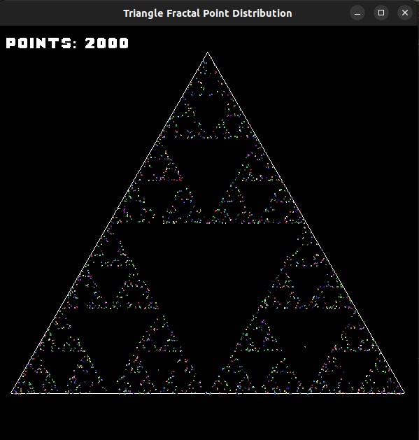

# Triangle Fractal Point Distribution



## Table of Contents

- [Triangle Fractal Point Distribution](#triangle-fractal-point-distribution)
  - [Overview](#overview)
  - [Features](#features)
  - [Usage](#usage)
    - [Compilation](#compilation)
    - [Execution](#execution)
  - [Dependencies](#dependencies)
  - [Contributing](#contributing)
  - [License](#license)

## Overview

The **Triangle** project demonstrates fractal point distribution within a triangle. It randomly places a point within the triangle, then randomly chooses one of its three vertices. A new point is placed at the midpoint of the line segment created, and the process repeats.

This project is written in C++ and utilizes the SFML graphics library.

## Features

- Random point placement within a triangle.
- Fractal-like distribution of points based on chosen vertices.
- Utilizes SFML for graphical representation.

## Usage

### Compilation

To compile the project, ensure you have SFML installed and properly linked in your environment. Use the provided `makefile` or compile manually with the appropriate commands for your system.

```bash bash terminal
make
```

### Execution
The binary can be executed with the following optional parameters:

* -p: Specifies the number of points to display in the triangle. Default is 500 points.
* -t: Sets the time (in ms) between the display of each point. Default is 50ms.
* -s: Sets the scale of the window. Default scale is 1, with a window size of 400x400.

### Example usage
```bash Terminal
./triangle -p 1000 -t 25 -s 2
```
This will display 1000 points with a time interval of 25ms between each point, and the window will be scaled by a factor of 2.

The order of the parameters does not matter

## Dependencies

* SFML library
* C++11 or later

## Contributing

Contributions are welcome! Feel free to fork the repository and submit pull requests for any improvements or fixes.